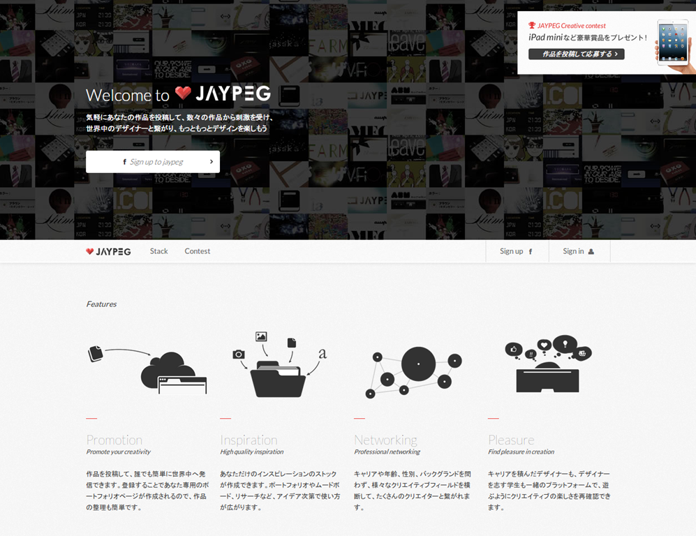

このサイトのデザインについて考える。 

[JAYPEG](https://jypg.net/) 

# トップ画像

背景に様々な画像をタイル状に配置している。 

ここで様々な作品の上に成り立つものだと伝えている。 

# ホワイトスペースとテクスチャ

サイトに空白が多いおかげですっきりしたスタイリッシュな印象を受ける。 

テクスチャでのあっさりとした質感もあいまっておしゃれな感じが演出できている。 

# モノクロベースの色合い

全体的にモノクロベースのカラーとなっており、コンテンツに色がついている。 

これはコンテンツが主役だということを意味しているように思える。
