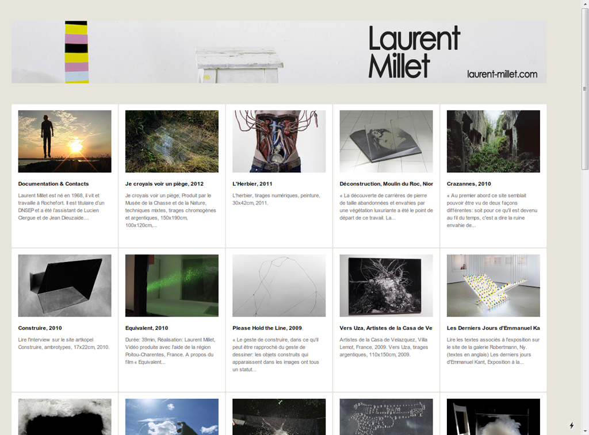

このサイトのデザインについて考える。

[Laurent Millet](http://www.laurent-millet.com/)

# コンテンツの並べ方

コンテンツが理路整然と並べられていて、写真が映えている。

写真のプロダクトの紹介がメインのサイトだとわかる。

# コンテンツの見せ方

アイテムをクリックすることでコンテンツが展開する。

展開されたサイズは横幅が並べられているコンテンツの3つ分となり、この画面のまま展開される。

展開された後も理路整然としていてストレスなくきれいにコンテンツの中身を見ることができる。

やはりページ遷移はできるだけない方がストレスはかからなくてすむ。
