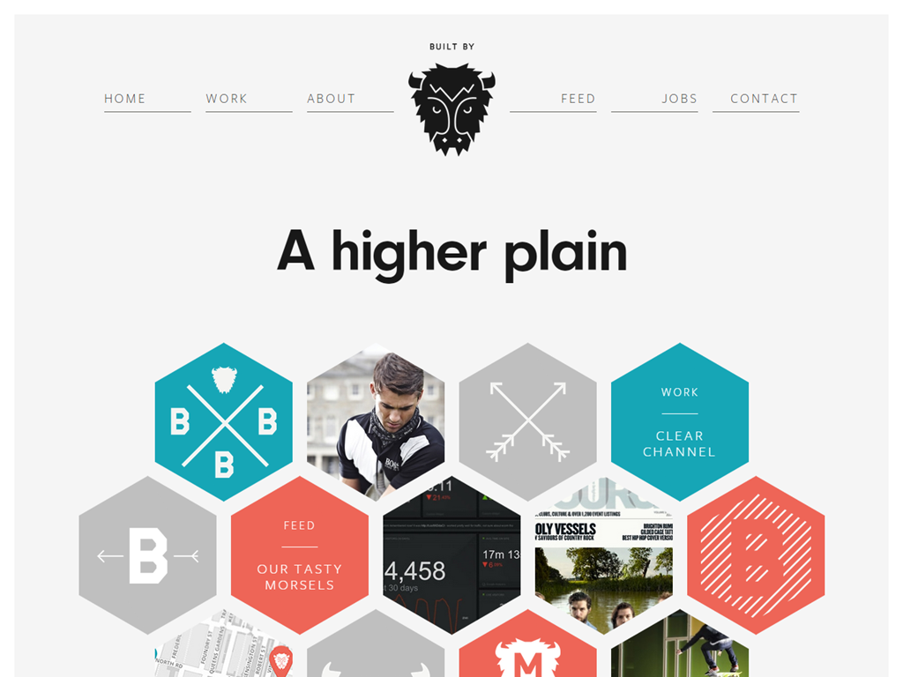
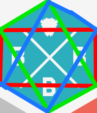

このサイトのデザインについて考える。

[Buffalo - Web Development, E-Commerce & Web Design - Brighton UK](http://builtbybuffalo.com/)

# ナビゲーションについて

ナビゲーションの形が六角形で特徴的である。

どうやらパララックスデザインの次は六角形ナビゲーションが流行するという話もあるようである。

# 六角形の実現方法

このサイトでは下記の図のように3つの長方形を組み合わせることで実現している。

こうすることによってマウスの判定も見た目と同様となりUXが向上すると思われる。
