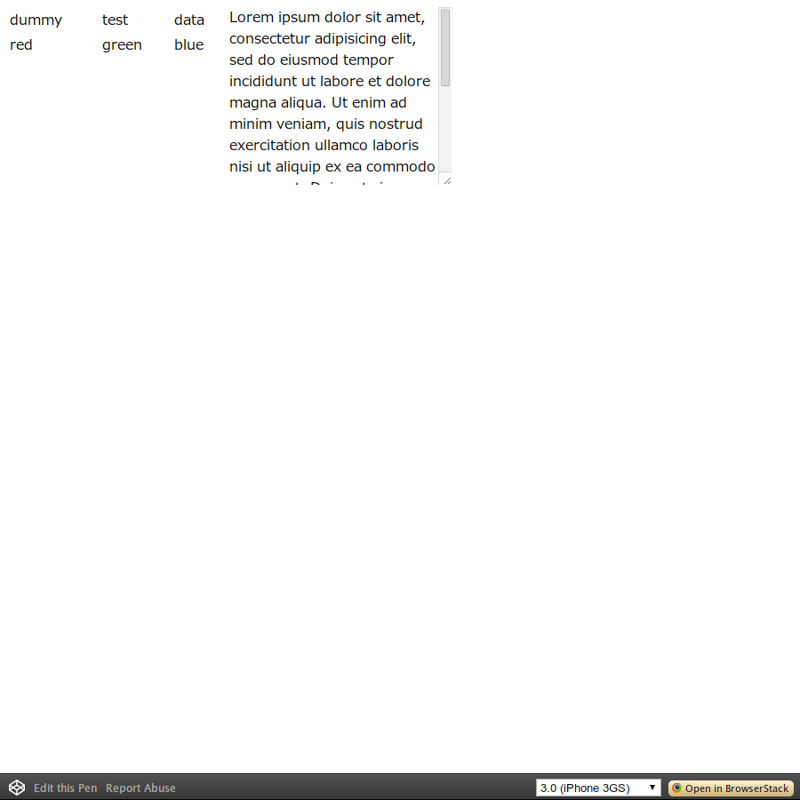

# デモ

文章では説明しづらいので、なんだかよくわからないタイトルになってしまいました。

まずは実際に見てもらった方が早いと思います。

    See the Pen qxgIF by SUGAWARA Hiroshi (@5000164) on CodePen

      ここではデモのために、ウィンドウの幅ではなくdivの幅を変更するようにしています。
divの幅を変更してみると、左側のテーブルの幅は変わらずに右側の文章の幅だけが変わっているのが確認できます。

実装方法

cssはこのようになっています。（関係のないプロパティは省略しています。）

```css
div {
  position: relative;
}
table {
  position: absolute;
  top: 0;
  left: 0;
  width: 250px;
}
p {
  margin: 0 0 0 250px;  
}
```

      非常に簡単です。
 まず、tableをposition: absolute;で固定することを考えます。  
 そのために親要素にposition: relative;を指定します。  
 これでtableの位置が固定されるので、あとは右側のコンテンツにmarginを指定してtableと重ならないようにします。  
これだけです。

複雑に考える必要はなかった

      最初に右側のコンテンツだけウィンドウサイズに応じて幅を変更させようとした時は、もっと複雑に考えていました。
 左側のコンテンツにmin-widthを指定して、左右のコンテンツにwidthでそれぞれ%を指定しようとしたのですが、これは%で指定すると幅が大きく変わった時にレイアウトが崩れるので断念。  
 次はJavaScriptでウィンドウサイズのイベントを取得して動的にwidthを変更するしかないかと思ったのですが、なるべくシンプルにいってJavaScriptは使いたくなかったので保留。  
 他にいい方法がないかと考えていた時にこの方法を思いつきました。  
 試しに実装してみたら期待通りの動きをしてくれたのでこの方法に決定。  
シンプルに書けるのはいいものです。

まとめ

この方法は応用が利きそうです。
