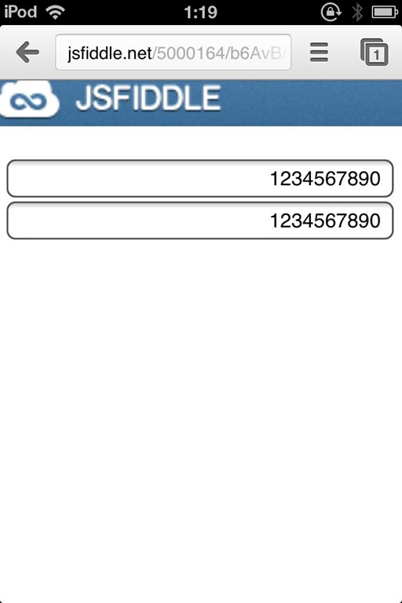
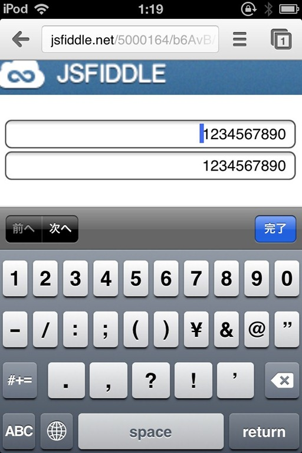
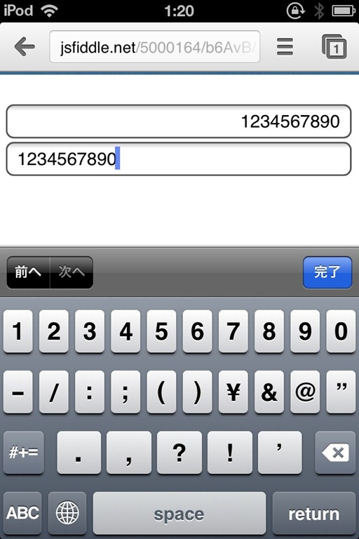

# iOSでの文字入力

iOSでテキストボックスに文字を入力しますよね。

カーソルを移動する矢印がないですよね。

不便ですよね。

文字を右寄せにしているともっと不便です。

右端までなかなか移動できません。

# どうして右寄せにしているのか

全部数字だったりすると桁を合わせて見やすくするためにも右寄せにしたりしますよね。

それが入力項目だから使いづらくなってるわけです。

# iOSでも入力しやすくする方法

ひらめきました。

focusがあたっている時は左寄せにしてあげればいいのです。

# デモとコード

# 動作画面

このように動作します。

テキストボックスに数字を右寄せで表示。

上のテキストボックスは特に何も設定をしていません。

文字を消すにはカーソルを右側に持って行かなければならないのですが手間がかかる。

下のテキストボックスはfocusがあたった時点で左寄せにしています。

このようになることで簡単に文字の右側にカーソルを持ってくることができます。

# まとめ

何気ないことですが、こういったことの積み重ねがUXの向上につながっていくと考えています。

ずっとどうすれば編集しやすくなるか考えていたので、1つの案としてこれが出てきたことでほっとしています。
