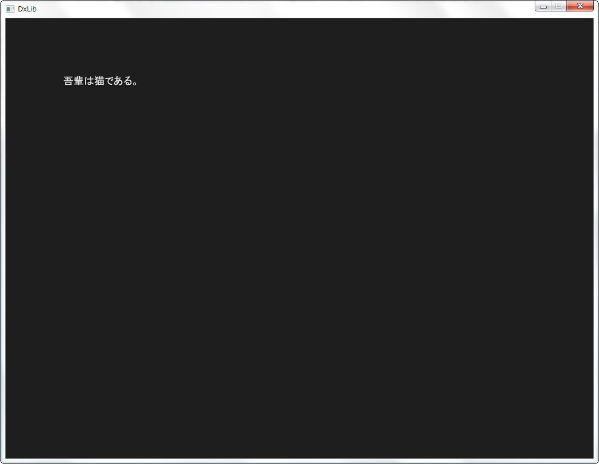
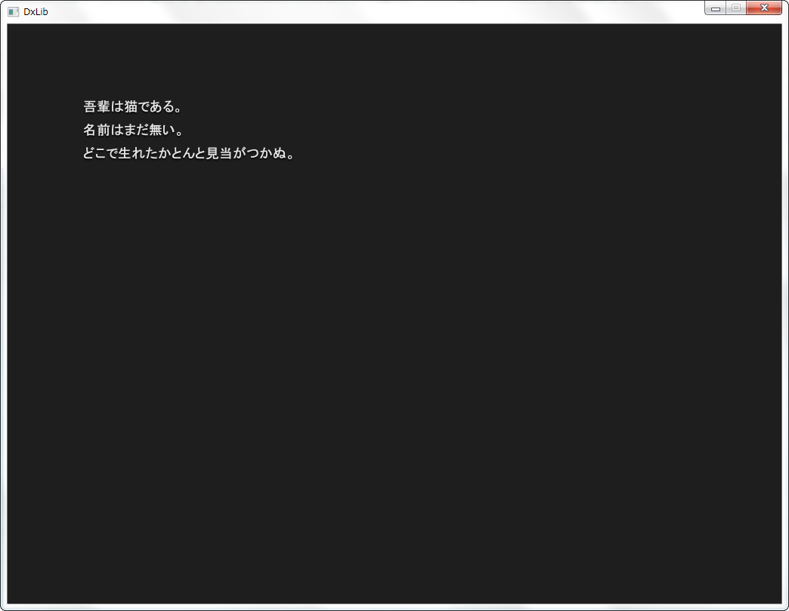

# 実行結果

これが。

こうなって。

こうなってって。

最終的にはこうなります。

正直こんなに長くする必要はなかった。

ソースコードはこちら。

[5000164/dxlib-practice-2](https://github.com/5000164/dxlib-practice-2)

# ゲームなんだから入力できるようにしなくては

[前回](/2014/3/16/dxlib-practice-1/) はDXライブラリで文字を表示するだけでしたが、こんどは入力を受け付けるようにします。

とりあえずエンターキーを押したら単純に表示するだけ。

# 表示するテキストをファイルから読み込むようにした

ついでに、表示するテキストを外部から読み込んでいます。

最初はUTF-8でテキストを書いていたら、文字化けをしてうまく読み込めません。

DXライブラリはShift\_JISとCRLFで書かれているので、テキストもShift\_JISとCRLFで書いたらうまくいきました。

プロジェクト全体の設定も、DXライブラリに合わせてShift_JISとCRLFで統一するのがいいと思います。

個人的にはUTF-8のLFが安心するのですが、DXライブラリを使っている時点で動作する環境はかなり限られるので、特に問題はないかと思います。

# まとめ

こんなに簡単な処理なのに、結構時間がかかりました。

やはり基礎的な知識がないと、どうすればいいのかわからないということが多いですね。
