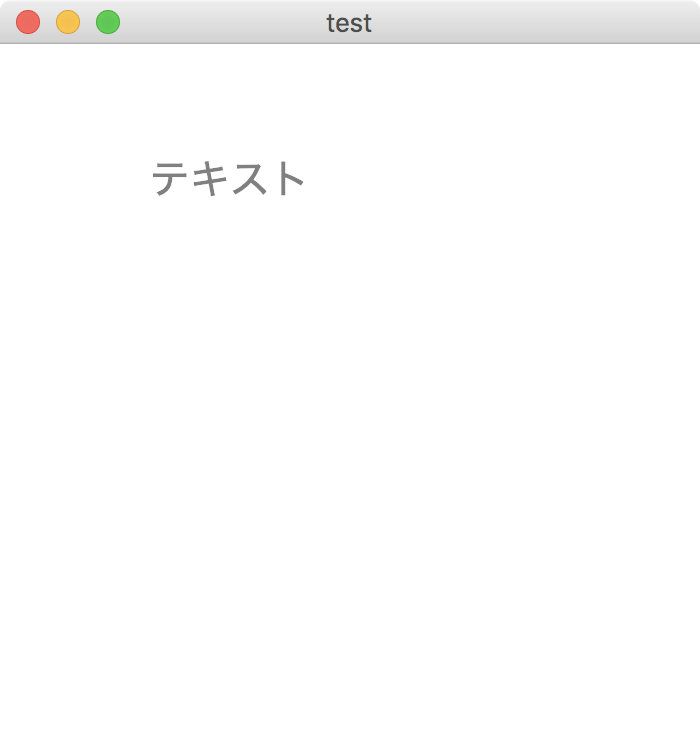

[昨日の記事](/2018/1/13/scala-javafx-image/) ではすでに存在する画像を表示したが、やりたいことは生成したテキストを画像にするということだったので、まずはテキストを表示できるようにする。  
最終的には画像にしたいので、画像に変換できる Canvas を利用する。  
コードはこんな感じ。

```scala
val c = new Canvas(300, 300)
val gc = c.getGraphicsContext2D
gc.setFill(Color.GRAY)
gc.setFont(Font.font("Hiragino Sans", 20))
gc.fillText("テキスト", 50, 50)
val root = new StackPane()
root.getChildren.add(c)
val scene = new Scene(root, 350, 350)
primaryStage.setTitle("test")
primaryStage.setScene(scene)
primaryStage.show()
```

このコードで下記のような実行結果になる。



# 参考

- [JavaFX 図形・Canvas｜軽Lab](http://krr.blog.shinobi.jp/javafx/javafx%20%E5%9B%B3%E5%BD%A2%E3%83%BBcanvas)
- [canvas - JavaFX GraphicsContext change text size - Stack Overflow](https://stackoverflow.com/questions/14530089/javafx-graphicscontext-change-text-size)

# 試行錯誤メモ

調べていたら `WritableImage` というもので画像を生成できると見かけたので最初は `WritableImage` で画像を表示してみたのだが、テキストを描画する方法がわからず、さらに調べていたら `Canvas` を発見したので `Canvas` を使用するようにした。

# 試行錯誤中に参考にしたもの

- [Java-Buddy: Draw something on WritableImage](http://java-buddy.blogspot.jp/2013/01/draw-something-on-writableimage.html)
- [Java Code Example javafx.scene.image.WritableImage](https://www.programcreek.com/java-api-examples/index.php?api=javafx.scene.image.WritableImage)
